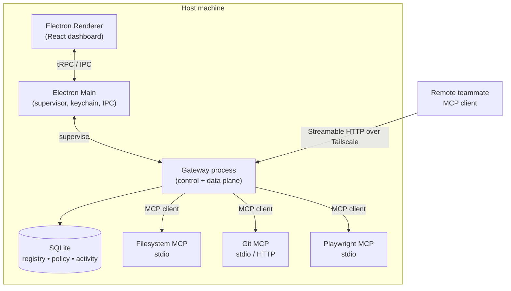

# Team MCP Gateway

> **Share your local MCP ecosystem with your team — without redeploying it to the cloud.**

**StormHacks 2026 · Team MCP**

---

## Table of Contents

1. [What It Is](#1-what-it-is)
2. [Why Use This Instead of a Cloud-Hosted MCP Server](#2-why-use-this-instead-of-a-cloud-hosted-mcp-server)
3. [Tech Stack](#3-tech-stack)
4. [Architecture](#4-architecture)
5. [Development Setup](#5-development-setup)
6. [Trade-Offs](#6-trade-offs)
7. [Additional Roadblocks](#7-additional-roadblocks)

---

## 1. What It Is

**Team MCP Gateway** is a local-first desktop application that lets a small team securely share access to [MCP](https://modelcontextprotocol.io) servers already running on one teammate's machine.

The gateway **defines no MCP tools of its own**. It sits in front of MCP servers you already run locally and adds a secure, team-oriented access layer around them:

- **Server registration** — point the gateway at existing MCP servers (`localhost:5001`, `localhost:5002`, …)
- **Remote access** — expose those servers to authorized teammates remotely. 
- **Authentication** — verify who is connecting
- **Authorization** — grant different users access to different servers and tools
- **Routing** — forward requests to the correct local server
- **Activity logging** — show the host exactly what remote users did

**The nuance that matters:** the gateway still speaks MCP to your teammates — to a remote client it *is* an MCP server, just a purely forwarding one. It acts as a **proxying MCP server** on the remote-facing side and an **MCP client** on the local-facing side, implementing nothing itself. Every tool, resource, and prompt it advertises already exists on a machine you control; the gateway only decides *who* may reach it and *routes* the call. The claim is "no tools of its own" — **not** "not an MCP server."

```text
                     Remote Teammate
                           │
                           │ Secure Connection (Tailscale / LAN)
                           ▼
                ┌─────────────────────┐
                │   Team MCP Gateway  │
                │                     │
                │ Authentication      │
                │ Authorization       │
                │ MCP Routing         │
                │ Server Discovery    │
                │ Activity Logging    │
                └──────────┬──────────┘
                           │
               Existing Local MCP Servers
                           │
            ┌──────────────┼──────────────┐
            ▼              ▼              ▼
       Filesystem MCP    Git MCP     Database MCP
```

**The problem it solves:** Local MCP servers are powerful precisely because they reach resources on a developer's machine — source code, local files, dev databases, browsers, containers, hardware. But they are configured for *one* person. Today, sharing them means every teammate reproduces the setup locally, or the team packages and redeploys those servers into cloud infrastructure. The gateway asks:

> What if a developer could securely share their existing local MCP servers with a small team, **without redeploying those MCP servers to the cloud**?

The underlying workloads keep running on team-controlled hardware. The gateway is only the shared access layer, and from a remote client's perspective, the experience should feel like talking to a remotely hosted MCP service.

---

## 2. Why Use This Instead of a Cloud-Hosted MCP Server

### Reuse the MCP setup that already exists

If one developer already has several useful MCP servers configured locally, the team does not need to recreate that setup for every developer — or rebuild it as a service. Register them once, share them deliberately.

### No redeployment, no cloud bill

An MCP server that works locally does not need to be packaged, containerized, given CI/CD, and redeployed to AWS, Azure, or GCP just so a teammate can call a tool. There is no hosted backend to operate, no account database to run, and no MCP hosting platform to pay for. **The project itself does not need to run any infrastructure.**

### Resources stay where the data lives

Cloud-hosted MCP servers force you to move or duplicate the resources they touch. The gateway keeps them in place: local repositories, local databases, local files, test environments, browsers, containers, and attached hardware all stay on the host. Nothing sensitive is copied into a third party's environment.

### Centralized access control instead of N separate tunnels

```text
Before:                              After:

Remote access → MCP A                     Remote access
Remote access → MCP B                          │
Remote access → MCP C                          ▼
                                            Gateway
                                          ├── MCP A
                                          ├── MCP B
                                          └── MCP C
```

Rather than configuring remote exposure, credentials, and firewall rules separately for every MCP server, the gateway becomes the single controlled entry point. Permissions, revocation, and audit logging live in one place.

### You own the trust boundary

If another teammate wants access, they often need to reproduce the same setup locally or move the MCP service into shared/cloud infrastructure. With cloud hosting, the trust boundary is the vendor's infrastructure and your team's configuration of it. Here, the trust boundary is a private network you control (e.g. your own tailnet) plus an authorization policy you can read, version, and audit — and the blast radius of a mistake is your machine's MCP surface, not a shared cloud tenant.

### Honest counterpoint

This is **not** the right choice when you need 24/7 availability, elastic scale, or access for people who cannot join your private network. If the tool must outlive the host's laptop lid, host it in the cloud. See [Trade-Offs](#6-trade-offs).

---

## 3. Tech Stack

> Because this project is built through **agentic development**, unfamiliarity with any individual technology is *not* treated as a blocker. The stack below is chosen for correctness of fit, ecosystem strength, and demo velocity — not for prior team experience.

### Desktop shell & Frontend

| Layer | Choice | Why |
| --- | --- | --- |
| Desktop shell | **Electron** | Cross-platform desktop app with a native process model — essential because we must spawn, supervise, and proxy **stdio-based MCP servers**, which a browser cannot do. |
| UI | **React 18 + TypeScript** | Required frontend. TypeScript is non-negotiable here: the MCP protocol is typed and the SDK is TS-first, so end-to-end types catch protocol mistakes at compile time. |
| Build tooling | **electron-vite** + **Vite** | Fast HMR for the renderer, first-class main/preload bundling, single config for all three processes. |
| Styling | **Tailwind CSS** + **shadcn/ui** | Fast, consistent dashboard UI (server list, user permissions, live activity feed) without designing a component library under time pressure. |
| State / data | **Zustand** + **TanStack Query** | Zustand for small local UI state; TanStack Query for subscription-like async state (server status, activity stream) with caching and invalidation. |
| Typed IPC | **tRPC over Electron IPC** | One type-safe contract shared between renderer and main process — no hand-written IPC message schemas. |
| Packaging | **electron-builder** | macOS/Windows/Linux installers, code signing, notarization, auto-update. |

### Backend, networking & architecture

| Layer | Choice | Why |
| --- | --- | --- |
| Gateway runtime | **Node.js + TypeScript** (separate gateway process) | The official `@modelcontextprotocol/sdk` is TypeScript-first, and Node's `child_process` makes stdio MCP transport trivial. Running the gateway as its **own process**, supervised by Electron, means the gateway keeps serving even if the UI window is closed. |
| MCP framework | **`@modelcontextprotocol/sdk`** (client *and* server) | The gateway is deliberately **both**: an MCP *client* to local servers, and a **proxying MCP *server*** to remote clients. It terminates the MCP protocol on the remote-facing side but **defines no tools of its own** — it only forwards calls to servers that already exist. See [What It Is](#1-what-it-is). |
| Local transports | **stdio** + **Streamable HTTP** | stdio for spawned local servers; Streamable HTTP for already-running local/remote servers, with SSE fallback for older ones. |
| Exposed transport | **Streamable HTTP** (MCP-canonical) | The gateway serves one modern endpoint to remote clients, with SSE backward-compatibility where needed. |
| Networking | **Tailscale** primary, **LAN** for local demo | Tailscale gives NAT traversal, WireGuard encryption, and device identity with zero infrastructure. We consume it — we do not rebuild it. Hostname/address discovered via `tailscale status --json`. |
| AuthN | **Tailscale identity (WhoIs)** + **Ed25519-signed session tokens** | `tailscale whois` maps a connection to a device/user identity; short-lived signed tokens scope that identity to a session. Secrets stored via Electron **`safeStorage`** (OS keychain). |
| AuthZ | **Policy file (declarative) → RBAC** | Identity → allowed servers → allowed tools, stored locally and hot-reloadable. |
| Persistence | **SQLite (`node:sqlite`)** | The gateway stores its server registry, policy, health, activity, and revoked-token data locally. The demo signup/login UI does not persist accounts. |
| Validation / config | **Zod** | Validate policy files, config, and untrusted protocol payloads at the boundary. |
| Logging | **pino** + SQLite activity store | Structured logs for debugging; a queryable activity log streamed live to the UI. |
| Testing | **Vitest** (unit) + **Playwright** (Electron E2E) | Fast unit tests for routing/policy; real end-to-end runs through the actual Electron app. |

The current login/signup screen is a **local UI demo only**: accounts and login events are held in memory and disappear when the app reloads. Development builds also include a **Skip for development** guest session; it is not included in production builds. Neither option authenticates gateway requests or replaces Tailscale identity and the gateway's server-side authorization policy. The gateway's existing SQLite store is for gateway data; account persistence is not implemented.

### Explicitly rejected for the MVP

- **Embedded Go/`tsnet` WireGuard** — clean long-term path to drop the Tailscale dependency, but too much surface area for a hackathon. Deferred to post-MVP.
- **`0.0.0.0` binding / public port exposure** — never. The gateway binds only to loopback and the tailnet interface.

---

## 4. Architecture

The key architectural decision is that the app is split into **two planes**:



- **Control plane** — the Electron UI and main process: registering servers, editing policy, viewing the activity log, starting/stopping the gateway.
- **Data plane** — the gateway process: authenticating peers, authorizing requests, and proxying MCP traffic.

Separating them means the gateway survives UI closure, can restart independently, and cannot be taken down by a renderer crash.

### Aggregation: one endpoint, many servers

The remote client connects to **one** MCP endpoint. The gateway merges the tool/resource namespaces of every authorized local server:

```text
Remote MCP Client
       │
       ▼
Single Gateway Endpoint
       │
       ├── filesystem__read_file
       ├── git__search_repository
       └── playwright__run_test
```

Tool names are namespaced by server ID (`<server>__<tool>`) to prevent collisions, and `tools/list_changed` notifications are forwarded so clients see updates live. A single aggregated connection is dramatically better UX and is what makes the gateway feel like a *team* MCP environment rather than a fan-out of tunnels.

### Security model (non-negotiables)

1. **Bind narrowly** — loopback + tailnet interface only; never `0.0.0.0`.
2. **Authenticate every connection** — identity from Tailscale, exchanged for a short-lived signed token.
3. **Authorize per request** — policy checked at the *tool* level, not just the server level.
4. **Redact in logs** — arguments and results are logged by shape/summary by default, with explicit opt-in to full capture.
5. **Fail closed** — unknown identity, expired token, or unsatisfiable policy ⇒ deny.

---

## 5. Development Setup

By design there is **no hosted component to provision** — no cloud account, no managed database, no domain. What follows is the local toolchain plus the small number of third-party accounts the demo genuinely needs.

### Prerequisites

**Required on every machine**

| Dependency | Version | Why |
| --- | --- | --- |
| **Node.js** | 20 LTS+ (**22 LTS recommended**) | Electron, the gateway process, and the electron-vite toolchain |
| **npm** | 10+ (bundled with Node) | Package management and all scripts |
| **Git** | 2.30+ | Version control, and the target of the Git MCP server demo |

Pin the version for the team with an `.nvmrc` / `.node-version` file, then `nvm use`.

**Native build toolchain (required)**

`better-sqlite3` is a native addon: it must be compiled for the local platform *and* rebuilt against Electron's ABI. That needs a C++ toolchain.

| Platform | Install |
| --- | --- |
| macOS | `xcode-select --install` (Xcode Command Line Tools) |
| Windows | Visual Studio Build Tools with the **Desktop development with C++** workload |
| Linux | `sudo apt install build-essential python3 libtool pkg-config` |

Then run `npm run rebuild` (wraps `@electron/rebuild`). Skipping this is the most common first-run failure — see [Common setup failures](#common-setup-failures).

> **Escape hatch:** if the native build blocks a machine, the persistence layer sits behind a small interface, so `better-sqlite3` can be swapped for `sql.js` (WASM, no toolchain) in one file. `node:sqlite` is built into Node 22+, but must be verified against Electron's bundled Node before relying on it.

**Optional**

| Dependency | When you need it |
| --- | --- |
| **Tailscale** | Any cross-network or remote testing. Not needed for loopback or LAN-only work. |
| **`uv` / `uvx`** | Only if you register Python-based stdio MCP servers (e.g. the reference Git server) |
| **Docker Desktop** | Only if you register container-based MCP servers or want to demo against a local database |
| **MCP Inspector** | Run via `npx` — nothing to install |

### Repository layout

```text
.
├── src/
│   ├── backend/        Node/Electron processes — no UI
│   │   ├── main/       Electron main process — supervisor, IPC, gateway supervision
│   │   ├── gateway/    Gateway process — its own entry point and bundle
│   │   └── shared/     Types + Zod schemas (protocol, policy, config)
│   └── frontend/       Everything that renders the UI
│       ├── preload/    contextBridge surface exposed to the renderer
│       └── renderer/   React dashboard (Vite)
├── config/             Tooling config (electron-vite, Vite, Vitest, Playwright, ESLint, tsconfigs)
├── test/
│   ├── fixtures/       Throwaway MCP servers used by tests
│   └── e2e/            Playwright + Electron specs
└── .env.example
```

`src/backend/gateway/` builds to a separate bundle that Electron launches as a child process, so it can be run and tested standalone without the UI.

### First run

```bash
git clone https://github.com/DevonYuan/StormHacks-2026.git
cd StormHacks-2026
git checkout devon-planning

nvm use                 # honours .nvmrc
npm install
npm run rebuild         # native modules → Electron ABI
cp .env.example .env    # then fill in the values below
npm run dev             # launches Electron with renderer HMR
```

The gateway listens on `GATEWAY_PORT` (default `8788`).

### Environment variables

| Variable | Default | Notes |
| --- | --- | --- |
| `GATEWAY_PORT` | `8788` | Gateway listener port |
| `GATEWAY_BIND_ADDR` | `127.0.0.1` | Loopback in dev; set to the tailnet IP for remote testing. **Never `0.0.0.0`.** |
| `TAILSCALE_CLI` | auto-detected | Override when the CLI is not on `PATH` (see the macOS note below) |
| `GITHUB_PERSONAL_ACCESS_TOKEN` | — | Only needed for the GitHub MCP server demo |
| `LOG_LEVEL` | `info` | Set to `debug` for verbose gateway logs |
| `REDACT_TOOL_PAYLOADS` | `true` | Leave `true` unless actively debugging — setting it to `false` writes tool arguments into the activity log |

`.env` is gitignored. **No signing keys or session secrets belong in `.env`:** the gateway generates its Ed25519 signing key on first run and stores it in the OS keychain via Electron `safeStorage`. CI has no keychain, so the gateway falls back to an ephemeral in-memory key there — acceptable because CI never shares a gateway with a remote peer.

### Accounts & services to create

| Service | Required for | Cost | What you actually need |
| --- | --- | --- | --- |
| **Tailscale** | Cross-network remote access — the core demo | Free | One account; every machine joined to the **same tailnet**. No API key, OAuth client, or auth key needed (the app only uses the local CLI). Invite teammates as users, or share your machine to their account. |
| **GitHub** | The Git / GitHub MCP server demo | Free | A **fine-grained PAT** scoped read-only to `Contents` + `Metadata`. Not a classic token with full `repo` scope. |
| **An AI client with model access** | Driving the remote end of the demo | Varies (you already have one) | Claude Desktop, or VS Code + Copilot Chat, or any MCP-capable client. The **gateway itself never needs a model API key.** |

Deliberately **not** needed: a cloud provider account, a hosted database, a domain name, an npm publish account, or any code-signing certificate. See below.

### Keeping every cost at zero

**There is exactly one line item in this project that could cost money — the Apple Developer Program — and the hackathon does not need it.**

Two facts make it avoidable:

1. **Only the host runs our app.** The remote teammate runs a stock **MCP client** (Inspector, VS Code, Claude Desktop), not our Electron build. There is no software to distribute, so there is nothing to sign.
2. **Locally built macOS apps are not quarantined.** Gatekeeper evaluates only files carrying the `com.apple.quarantine` attribute, which is applied by *downloaders* — browsers, AirDrop, Mail — not by `npm run build`. Building and running on the host machine sidesteps the problem entirely. On Apple Silicon the build is ad-hoc signed automatically, which is sufficient to execute locally.

So the free default is to run from source on the host:

```bash
npm run build && npm start
```

Reach for `electron-builder` only if you want to hand the gateway to someone else as an installer. Should it come to that, here is what signing actually costs:

| Platform | Signed | Unsigned (free) |
| --- | --- | --- |
| **Windows** | OV code-signing certificate (~$100–400/year), or Azure Trusted Signing (~$10/month). OSS projects can apply for free signing through SignPath Foundation. | Works. The user dismisses a SmartScreen "Windows protected your PC → More info → Run anyway" prompt once. |
| **macOS** | Apple Developer Program, **$99/year**. There is no free tier for Developer ID signing or notarization. | Works **when built locally** (see above). A copy sent to another Mac picks up the quarantine flag, and the user must right-click → Open or run `xattr -dr com.apple.quarantine <app>`. |
| **Linux** | n/a | **Free either way** — `.AppImage` and `.deb` carry no signing requirement, so there is nothing to buy and nothing to skip. |

**Practical recommendation:** if the team is on Macs, stay on macOS and simply do not sign. Switching to Windows buys nothing here, because the cost was never in the operating system — it was in *distributing signed installers*, which the hackathon does not require. Windows is still a completely free development platform if the team prefers it: VS Build Tools, Node, Git, and Tailscale all cost nothing.

### (Preferred path) Shipping builds to other people

If the gateway graduates from a hackathon demo into something teammates download from a website, **the cost is decided by the platform you ship *to*, not the machine you build *on*.** Building on any OS is free — Node, electron-builder, and CI runners all cost nothing. What costs money is a code-signing certificate, and those are per **target** platform.

| You ship to | Free download experience? | What users see unsigned |
| --- | --- | --- |
| **Windows** | Yes | The downloaded `.exe` carries Mark-of-the-Web, so SmartScreen shows "Windows protected your PC → More info → Run anyway" — once per version. |
| **Linux** | Yes | Nothing at all. `.AppImage` and `.deb` have no signing requirement. |
| **macOS** | No | The browser applies `com.apple.quarantine`, so Gatekeeper refuses to launch it. Users must go to System Settings → Privacy & Security → **Open Anyway**, or run `xattr -dr com.apple.quarantine <app>`. **No free certificate removes this.** |

So: **yes, a completely free Windows `.exe` installer is achievable** — and **no**, building on a different OS does not make the macOS download free.

#### A free Windows `.exe` installer

electron-builder's NSIS target produces a standard `.exe` installer. No certificate, no account, no cost — just ship unsigned and accept the one-click SmartScreen prompt:

```jsonc
// electron-builder config (excerpt)
{
  "win": {
    "target": ["nsis"],
    "icon": "build/icon.ico"
  },
  "nsis": {
    "oneClick": false,
    "allowToChangeInstallationDirectory": true
  }
}
```

```bash
npm run package -- --win     # → dist/<name>-Setup-<version>.exe
```

> **Build it on Windows or in CI — not on macOS.** Cross-compiling a Windows installer from macOS makes electron-builder shell out to Wine and is a frequent source of broken builds. A GitHub Actions `windows-latest` job builds it for free, and on a **public** repository Actions minutes are unmetered.

Optional, if you later want the prompt gone: **SignPath Foundation** (free signing for eligible open-source projects, requires an application and an OSI-approved licence), **Azure Trusted Signing** (~$10/month), or an **OV certificate** (~$100–400/year). None are required to ship — they only remove a warning.

#### The macOS situation, stated plainly

There is no free path to a smooth macOS download. Notarization requires a Developer ID certificate, which requires the $99/year Apple Developer Program, and Apple offers no free tier. Your options are:

1. **Pay $99/year** if macOS users must double-click and go.
2. **Ship unsigned** and document the Privacy & Security workaround for them.
3. **Ship source instead** — users clone and run `npm run build && npm start`. Locally built apps are not quarantined, so this avoids the problem entirely. This is the honest free option for Mac users.

### Local MCP servers to register for the demo

| Server | Run with | Purpose in the demo |
| --- | --- | --- |
| Filesystem | `npx -y @modelcontextprotocol/server-filesystem <absolute-path>` | The headline demo: a remote AI lists and reads files on the host |
| Playwright | `npx -y @playwright/mcp@latest` | A remote AI drives a browser on the host |
| Git | `uvx mcp-server-git --repository <path>` | Proves a **Python** stdio server works alongside Node ones |
| Everything (test) | `npx -y @modelcontextprotocol/server-everything` | Test fixture — exercises the full protocol surface |

Server package names shift over time; verify against the [MCP servers repository](https://github.com/modelcontextprotocol/servers) before the demo. Give the filesystem server a scratch directory, **not** your home folder.

### Configuring MCP clients for testing

**MCP Inspector — start here, no account needed**

```bash
npx @modelcontextprotocol/inspector
```

Point Inspector at the gateway's aggregated Streamable HTTP endpoint (`http://localhost:8788/mcp`, or `http://<host>.<tailnet>.ts.net:8788/mcp` for remote) to exercise `tools/list` and `tools/call` by hand. This is the fastest way to validate the gateway without involving a model at all.

**VS Code** — `.vscode/mcp.json`:

```json
{
  "servers": {
    "team-gateway": {
      "type": "http",
      "url": "http://localhost:8788/mcp"
    }
  }
}
```

**Claude Desktop** — add the same endpoint to `claude_desktop_config.json`. Only needed for the AI-driven path; the Inspector covers protocol testing.

The **remote** machine's client points at the host's tailnet address (`http://<host>.<tailnet>.ts.net:8788/mcp`) instead of `localhost`.

### Tailscale setup (for remote / cross-network testing)

Tailscale is what lets two machines on **different WiFi networks** reach each other: the gateway binds
its tailnet interface, and peers dial its `100.x.y.z` address or MagicDNS name. The app consumes the
Tailscale you already have — it only shells out to the local `tailscale` CLI (`tailscale status
--json`, `tailscale whois`).

#### What this requires in your Tailscale account

**Nothing needs to be created or configured in the Tailscale admin console by our app — it uses no
API key, OAuth client, auth key, or billing.** You just need a working tailnet and the peers on it:

| Action | Required? | Why |
| --- | --- | --- |
| Install Tailscale + `tailscale up` (sign in) on the **host** | **Yes** | The gateway discovers its own address and resolves peers via the local CLI |
| Get every teammate onto the **same tailnet** | **Yes** | Tailscale only connects devices within one tailnet |
| Change ACLs | Only if you've customized them | A personal tailnet defaults to **allow all**; otherwise allow the gateway port (e.g. `8788`) between peers |
| Enable **MagicDNS** | Optional | Lets peers use `host.tailnet.ts.net`; plain `100.x` IPs work without it |
| Create an API key / OAuth client / auth key | **No** | Not used anywhere in the app |
| Upgrade your Tailscale plan | **No** | The free plan is enough for a small demo |

**Getting teammates onto the same tailnet** — pick whichever fits your account:

- **Same account (simplest for a demo):** everyone signs into one Tailscale account.
- **Invite as users:** on an organization tailnet, invite teammates as users in the admin console.
- **Share your node:** on a personal tailnet, use **Admin console → Machines → Share** to share the
  host machine with a teammate's account. Note this is **one-directional** — for the host to reach a
  teammate's gateway, they must share back (or you all use one tailnet).

#### Steps

1. Install Tailscale and sign in on **both** machines; confirm they are on the **same** tailnet.
2. (Optional) Enable **MagicDNS** in the admin console so the tailnet hostname resolves.
3. Verify from the remote machine:

```bash
tailscale status --json | jq '.Self.DNSName'
tailscale ping <host-machine>
```

4. On the host, expose the gateway. The easiest path is the **"Open a connection"** button in the
   Network page, which reads the host's tailnet IP and (re)binds the gateway to it automatically.
   The manual equivalent is to set `GATEWAY_BIND_ADDR` to the host's tailnet IP (`100.x.y.z`) —
   **never `0.0.0.0`**.
5. On the remote machine, add the host's endpoint to your MCP client (see
   [Configuring MCP clients](#configuring-mcp-clients-for-testing)):
   `http://<host>.ts.net:8788/mcp` (or `http://100.x.y.z:8788/mcp`).

#### Platform gotchas

**macOS:** the app bundle does not put the CLI on `PATH`. Either call the full path or symlink it:

```bash
sudo ln -s /Applications/Tailscale.app/Contents/MacOS/Tailscale /usr/local/bin/tailscale
```

The gateway shells out to `tailscale status --json` and `tailscale whois`, so a missing CLI is a
setup blocker — point the gateway at it with `TAILSCALE_CLI` if you would rather not symlink.

**Linux:** grant your user access to the daemon so `whois` works without `sudo`:

```bash
sudo tailscale set --operator=$USER
```

#### How the host recognises a peer

On connect, the gateway resolves the caller's identity from the **source IP of the connection** (not
from a token): a tailnet `100.x` address is mapped through `tailscale whois <ip>` to
`{ user, device, deviceId, tailnet }`; loopback/private addresses map to `local@dev`. That identity is
then checked against the policy document before any tool call is forwarded.

> **Verify `whois` output on your machine.** The gateway runs `tailscale whois <ip>` and parses the
> result as JSON. If your CLI prints the human-readable form by default, identity resolution fails and
> the session falls back to `local@dev` (which the bootstrap policy allows). Check with
> `tailscale whois --json <ip>`.

**No Tailscale? Stay local (loopback).** With the default `GATEWAY_BIND_ADDR=127.0.0.1`, the gateway is
reachable only from the host machine. Cross-machine sharing in this MVP is Tailscale-only — the
"Open a connection" action binds the **tailnet** interface, not a LAN address, so two machines on the
same WiFi without Tailscale will not connect.

### Testing setup

| Layer | Command | Requirements |
| --- | --- | --- |
| Unit — policy, routing, namespacing | `npm run test:unit` | None; pure functions |
| Integration — gateway ↔ fixture MCP server | `npm run test:integration` | Spawns the fixture server locally; no network, no accounts |
| E2E — Electron UI | `npm run test:e2e` | Run `npx playwright install` first |
| Cross-machine | manual checklist | Two machines, Tailscale on both |
| **CI gate (local)** | `npm run test:ci` | Runs `typecheck && lint && test` |
| **TDD watch mode** | `npm run test:watch` | Vitest watch mode for rapid feedback |

`npm test` runs the unit and integration suites together — that is the command CI gates on.

**Design rule: tests never depend on the demo MCP servers, on Tailscale, or on a model.** Fixtures and loopback only. The cross-machine path is verified by a scripted manual checklist, because it cannot be automated in CI.

First-time Playwright setup:

```bash
npx playwright install              # macOS / Windows
npx playwright install --with-deps  # Linux
```

**CI (GitHub Actions):** Linux runners need `xvfb-run` to launch Electron headlessly and `build-essential` for the native SQLite module. There is no Tailscale in CI, so CI exercises loopback mode only. Gate merges on `npm run typecheck && npm test`.

### npm scripts

#### Core scripts (CI gates)
| Script | What it does |
| --- | --- |
| `npm run dev` | electron-vite dev server — renderer HMR plus main/preload restart |
| `npm start` | Runs the built app (`electron-vite preview`) — no installer, no signing needed |
| `npm run gateway:dev` | Runs the gateway standalone with `tsx watch`, no Electron |
| `npm run build` | Typecheck, then bundle main, preload, renderer, and gateway |
| `npm run rebuild` | Rebuild native modules against Electron's ABI |
| `npm run typecheck` | `tsc --noEmit` across all entry points |
| `npm run lint` | ESLint |
| `npm test` | Vitest — unit and integration suites together |
| `npm run test:unit` | Vitest — unit tests only |
| `npm run test:integration` | Vitest — integration tests only, against the local fixture MCP server |
| `npm run test:e2e` | Playwright Electron specs |
| `npm run inspector` | Launches MCP Inspector against the running gateway |
| `npm run package` | electron-builder installers for the current platform |

#### Development helper scripts (smoother DX)
| Script | What it does |
| --- | --- |
| `npm run dev:all` | Runs `dev` + `gateway:dev` concurrently via `concurrently` (single command for full dev stack) |
| `npm run dev:clean` | Kills running processes, clears `.vite` cache, restarts `dev:all` |
| `npm run test:watch` | Vitest in watch mode for TDD |
| `npm run test:ci` | Runs `typecheck && lint && test` (exact CI gate command) |
| `npm run db:migrate` | Runs migration runner against `gateway.db` (manual DB work) |
| `npm run db:reset` | Deletes `gateway.db`, re-runs all migrations (clean slate) |
| `npm run lint:fix` | ESLint `--fix` + Prettier write |
| `npm run format` | Prettier write on all source files |
| `npm run check:types` | Alias for `typecheck` (`tsc --noEmit`) |
| `npm run gateway:logs` | Tails gateway process logs (when running via `gateway:dev`) |

### Common setup failures

| Symptom | Cause | Fix |
| --- | --- | --- |
| `NODE_MODULE_VERSION` mismatch | `better-sqlite3` built for Node, not Electron | `npm run rebuild` |
| `tailscale: command not found` | macOS app install does not add the CLI to `PATH` | Symlink it, or set `TAILSCALE_CLI` |
| Gateway unreachable from the other machine | Bound to `127.0.0.1`, or the OS firewall blocked the port | Set `GATEWAY_BIND_ADDR` to the tailnet/LAN IP and allow the port when prompted |
| `whois` returns nothing | Daemon permissions (Linux) | `sudo tailscale set --operator=$USER` |
| E2E fails to launch Electron | CI runner has no display | Wrap in `xvfb-run` (Linux only) |
| `uvx: command not found` | Python MCP server registered without `uv` installed | Install `uv`, or drop the Python server from the registry |

---

## 6. Trade-Offs

These are deliberate, and we would rather state them than let them be discovered in the demo.

| Trade-off | What we give up | Mitigation |
| --- | --- | --- |
| **Host availability** | If the host machine sleeps or goes offline, every shared MCP server becomes unavailable. Remote teammates inherit the host's uptime. | Surface host/gateway status clearly; health checks and a reconnect story; document that this is a dev tool, not a production service. |
| **Host performance** | All remote requests execute on the host's hardware, competing with the host's own work. | Per-server concurrency caps and timeouts; visible activity log so contention is attributable. |
| **Networking dependency** | Cross-network access still requires a third-party networking layer (Tailscale) or a shared LAN. | LAN works out of the box for the demo; treat the network as a pluggable transport so Headscale/WireGuard/SSH can slot in later. |
| **Security surface** | We are intentionally exposing capabilities from someone's machine to other people. A misconfiguration leaks filesystem, database, or browser access. | Narrow binding, per-tool authorization, short-lived tokens, redacted logs, fail-closed defaults. |
| **Aggregation complexity** | One unified endpoint means merged namespaces, name collisions, and protocol-level translation. | Namespacing scheme from day one; per-server routing first, then layer aggregation behind a single endpoint. |
| **MCP compatibility** | Different MCP servers use different transports and capability assumptions. This is likely our single largest technical risk. | Support stdio + Streamable HTTP (SSE fallback); capability negotiation rather than hard-coding; treat unsupported features as explicit errors, not silent failures. |
| **Single point of failure** | The gateway is a chokepoint and a trust chokepoint. If it fails, everything behind it is unreachable. | Keep the data plane a separate, supervised process; crash-isolate and auto-restart. |
| **No cloud conveniences** | No managed accounts, no centralized policy store, no elastic scale, no vendor SLA. | This is the point: zero infrastructure and full data locality in exchange for these. |

---

## 7. Additional Roadblocks

Beyond the documented trade-offs, these are the sharp edges we expect to hit.

### Protocol & compatibility

- **Transport divergence.** stdio servers are spawned child processes with a fragile lifecycle; Streamable HTTP servers may be stateful and session-scoped. Normalizing both behind one interface is real work.
- **Orphaned child processes.** A crashed gateway can leave spawned stdio MCP servers running. Requires explicit process groups and teardown on exit.
- **Not just tools.** MCP also has resources, prompts, and completions. Clients may assume all four exist; partial support must fail loudly and legibly.
- **Bidirectional features.** Sampling, elicitation, roots, progress notifications, and cancellation all flow *host → client*. Forwarding them across a proxy hop is significantly harder than simple request/response.
- **Long-running calls.** Streaming results, progress, and timeouts must survive the extra hop; a naive proxy will deadlock or silently truncate.
- **Protocol version negotiation.** The MCP spec is moving. Client and server may negotiate different versions, and the gateway sits in the middle of that negotiation.
- **Session state.** Streamable HTTP sessions, reconnect behavior, and resumability need a coherent story or clients will drop unexpectedly.

### Security

- **Confused-deputy risk.** The gateway holds credentials for upstream MCP servers. A bug can let a remote caller act with the host's privileges.
- **Prompt injection across the boundary.** Remote model output can steer tools that act on host resources. Authorization must be enforced server-side, never inferred from model intent.
- **Token handling.** Issue, rotate, expire, and revoke — and never persist them in plaintext (OS keychain via `safeStorage`).
- **Logging as a liability.** Activity logs can capture sensitive arguments and file contents. Redaction must be the default, not a setting someone forgets.

### Platform & distribution

- **Firewall prompts.** macOS and Windows will interrupt the user the first time the gateway listens on a port — and a mis-clicked "Deny" is hard to recover from.
- **Code signing & notarization.** An unsigned Electron app is a demo-time obstacle on modern macOS; certificate and notarization setup is its own sub-project.
- **Cross-platform stdio differences.** `PATH`, shell resolution, and signal handling differ between macOS, Windows, and Linux.
- **Tailscale prerequisites.** Tailscale must be installed, logged in, and correctly ACL'd on *both* machines. Silent misconfiguration is a common failure mode; we should detect and explain it, not just fail.

### Discovery & lifecycle

- **Importing existing configs.** Users already have MCP config (e.g. `claude_desktop_config.json`, VS Code `mcp.json`). Importing and translating those is high-value but schema-quirky; hand-rolled registration is the safe fallback.
- **Health and crash loops.** A misbehaving local MCP server can flap. The gateway needs backoff, quarantine, and clear status rather than hammering restart.
- **Multi-host ambiguity (future).** Once two hosts share servers, identity, policy, and tool-name collisions become distributed-systems problems.
- **Demo fragility.** Cross-network demos fail at the worst moment. The demo plan needs a rehearsed fallback (same-LAN mode) that still tells the story.

### Scope

- **Hackathon time is the scarcest resource.** The temptation is to build aggregation, WebAuthn, and an embedded WireGuard stack simultaneously. Sequencing the PoC first means that if we run out of time, we ship a working *gateway*, not three half-finished subsystems. Hence, the importance of planning. 

---

<p align="center"><em>Team MCP Gateway — share your local MCP ecosystem with your team.</em></p>
